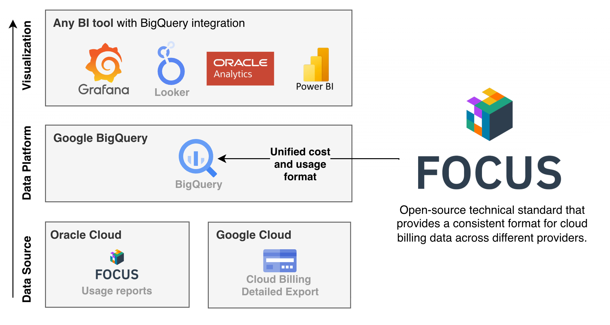

# Multi-Cloud Cost Analytics with FOCUS

Organizations run workloads on both Google Cloud and Oracle Cloud Infrastructure — whether through Oracle Interconnect for Google Cloud, Oracle Database@GCP, or simply using both platforms. 

Multi-cloud usually means multiple billing formats, portals, and reports. Comparing costs across GCP and OCI shouldn't require spreadsheets and manual work.

This tool brings your cost data together into a common format. Runs on  and .

---

### What it does

- **Syncs** OCI FOCUS billing reports to Google Cloud Storage
- **Transforms** flat files into Hive-partitioned format for fast queries
- **Unifies** OCI and GCP cost data in BigQuery with a compatible schema
- **Enables** single-pane dashboards in Looker Studio, Grafana, or any BI tool



### How it works

Both clouds now support [FOCUS](https://focus.finops.org/) (FinOps Open Cost & Usage Specification). This tool syncs OCI's FOCUS exports into BigQuery with a schema that matches GCP's — so you can query, compare, and visualize all your cloud costs in one place.

> **More info:** [Oracle Cloud - FOCUS Support Announcement](https://blogs.oracle.com/cloud-infrastructure/announcing-focus-support-for-oci-cost-reports) · [Google Cloud - FOCUS Support Announcement](https://cloud.google.com/blog/topics/cost-management/cloud-costs-come-into-view-with-focus-v1-0-ga)

## Prerequisites

### Google Cloud

- **Detailed Usage Export** enabled
- **Cloud Pricing Export** enabled

See [focus-gcp.md](focus-gcp.md) for more information on setting up the GCP FOCUS view.

### Oracle Cloud Infrastructure

1. Create a service user and place into a user group
2. Generate an API key for the service user
3. Grant the following IAM policies to the user group:

```
define tenancy usage-report as ocid1.tenancy.oc1..aaaaaaaaned4fkpkisbwjlr56u7cj63lf3wffbilvqknstgtvzub7vhqkggq
endorse group read-usage-report-group to read objects in tenancy usage-report
Allow group read-usage-report-group to manage usage-report in tenancy
```

Do not adapt the tenancy ocid, an Oracle-managed tenancy manages this usage data.

## Quick Start (Local)

```bash
# 1. Configure rclone
cp rclone.conf.example rclone.conf
# Edit rclone.conf with your OCI and GCS credentials

# 2. Configure environment
cp .env.example .env
# Edit .env with your settings

# 3. Build and run (Docker)
docker build -t oci-focus-sync .
docker run --env-file .env \
  -v $(pwd)/rclone.conf:/app/rclone.conf:ro \
  -v $GOOGLE_APPLICATION_CREDENTIALS:/app/gcp-key.json:ro \
  -e GOOGLE_APPLICATION_CREDENTIALS=/app/gcp-key.json \
  oci-focus-sync

# Or run directly with Bun (requires rclone installed locally)
bun install
bun run src/index.ts
```

### Environment Variables

| Variable | Description | Default |
|----------|-------------|---------|
| `OCI_TENANCY_OCID` | Your OCI tenancy OCID | required |
| `GCS_STAGING_BUCKET` | GCS bucket for raw sync | required |
| `GCS_HIVE_BUCKET` | GCS bucket for Hive-partitioned data | required |
| `GCS_PROJECT_ID` | Your GCP project ID | required |
| `GOOGLE_APPLICATION_CREDENTIALS` | Path to GCP service account key (local only — not needed on Cloud Run) | — |
| `SYNC_MODE` | `full` or `incremental` | `incremental` |
| `DAYS_TO_SYNC` | Days to process (incremental mode) | `7` |
| `DRY_RUN` | Test without copying | `true` |

### Rclone Configuration

See `rclone.conf.example` for the required remotes:
- `oci-usage-reports-config` — OCI Object Storage (S3-compatible)
- `gcs-config` — Google Cloud Storage

## Automated Deployment (using Google Cloud Run)

For production, deploy as a scheduled Cloud Run job. GCP credentials are picked up automatically from the Cloud Run service account — `GOOGLE_APPLICATION_CREDENTIALS` is not needed.

> **Note:** The Dockerfile bakes `rclone.conf` into the image for simplicity. For production, consider storing it in [Secret Manager](https://cloud.google.com/run/docs/configuring/services/secrets) and mounting it as a volume instead.

```bash
# Build and push to Artifact Registry
gcloud builds submit --tag gcr.io/PROJECT_ID/oci-focus-sync

# Create Cloud Run job
gcloud run jobs create oci-focus-sync \
  --image gcr.io/PROJECT_ID/oci-focus-sync \
  --set-env-vars "OCI_TENANCY_OCID=ocid1.tenancy...,GCS_STAGING_BUCKET=...,GCS_HIVE_BUCKET=...,GCS_PROJECT_ID=...,SYNC_MODE=incremental,DRY_RUN=false" \
  --region europe-west1

# Schedule daily execution
gcloud scheduler jobs create http oci-focus-sync-daily \
  --location europe-west1 \
  --schedule "0 6 * * *" \
  --uri "https://europe-west1-run.googleapis.com/apis/run.googleapis.com/v1/namespaces/PROJECT_ID/jobs/oci-focus-sync:run" \
  --http-method POST \
  --oauth-service-account-email PROJECT_NUMBER-compute@developer.gserviceaccount.com
```

## BigQuery External Table

Create an external table using the included table definition (schema renames columns to match GCP FOCUS format):

```bash
# Edit bq_table_def.json to update the bucket name if needed, then:
bq mk --external_table_definition=bq_table_def.json \
  PROJECT_ID:DATASET.oci_focus_reports
```

Column renames applied:
- `Provider` → `ProviderName`
- `Publisher` → `PublisherName`
- `Region` → `RegionId`

## Unified Query

Query both GCP and OCI costs together:

```sql
SELECT ProviderName, SUM(BilledCost) as total_cost
FROM (
  SELECT ProviderName, CAST(BilledCost AS FLOAT64) as BilledCost
  FROM `DATASET.gcp_focus_reports`
  UNION ALL
  SELECT ProviderName, BilledCost
  FROM `DATASET.oci_focus_reports`
)
GROUP BY ProviderName
```

## Unified View (Optional)

For dashboards (Looker Studio, Grafana), create a unified view:

```sql
CREATE OR REPLACE VIEW `DATASET.unified_focus` AS
SELECT
  ProviderName,
  CAST(BilledCost AS FLOAT64) AS BilledCost,
  CAST(EffectiveCost AS FLOAT64) AS EffectiveCost,
  ServiceName,
  RegionId,
  ChargeCategory,
  ChargeDescription,
  ChargePeriodStart,
  ChargePeriodEnd,
  BillingPeriodStart,
  BillingPeriodEnd,
  BillingCurrency,
  ResourceId,
  ResourceName
FROM `DATASET.gcp_focus_reports`
UNION ALL
SELECT
  ProviderName,
  BilledCost,
  EffectiveCost,
  ServiceName,
  RegionId,
  ChargeCategory,
  ChargeDescription,
  ChargePeriodStart,
  ChargePeriodEnd,
  BillingPeriodStart,
  BillingPeriodEnd,
  BillingCurrency,
  ResourceId,
  ResourceName
FROM `DATASET.oci_focus_reports`
```

Then query from a single source:

```sql
SELECT ProviderName, ServiceName, SUM(BilledCost) as total_cost
FROM `DATASET.unified_focus`
GROUP BY 1, 2
ORDER BY total_cost DESC
```